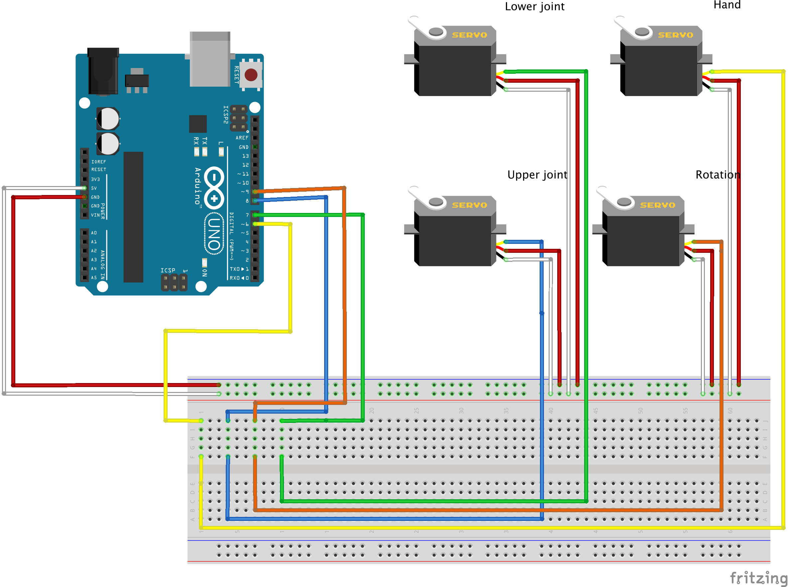

# Programming 4 Degrees of freedom robotic arm

**Plan:** 
- [x] build and connect the arm
- [ ] program the movement
- [ ] add bluetooth connectivity to the system
- [ ] build Android app to control the arm

## Schema
